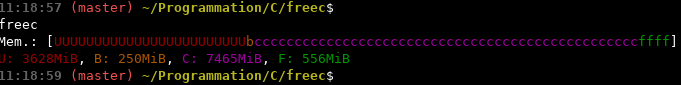

# FREEC - Like free(1), but better

`freec` plays the same role than `free` but in a simpler and a more graphical way.

You can simply grasp what is your total **Used** memory, memory reserved for **buffers**, **cache**, and **free** memory.
